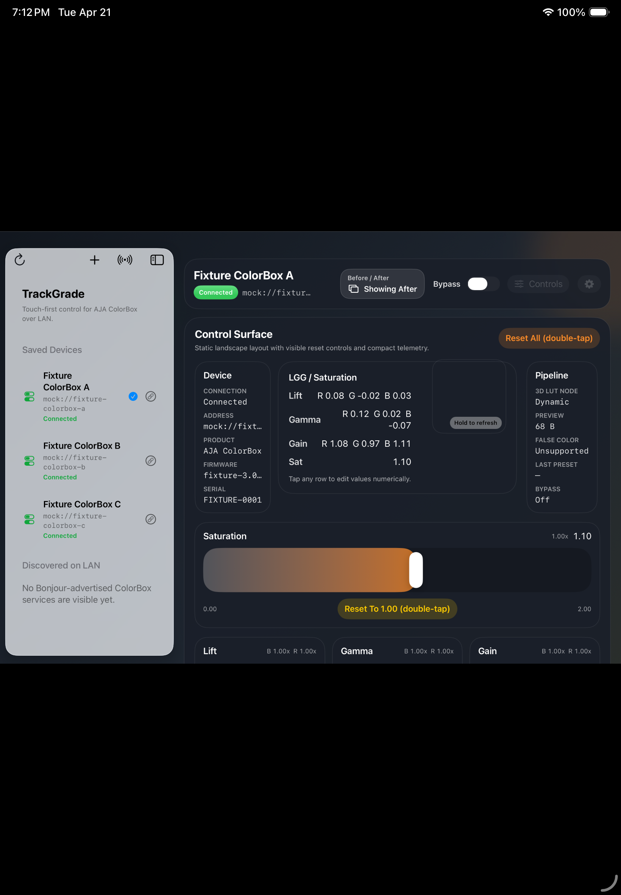

# TrackGrade

TrackGrade is an open-source native iPadOS 18+ control surface for live color grading with AJA ColorBox hardware over a local network. It is purpose-built for fast, touch-first Lift/Gamma/Gain adjustments during live IMAG workflows, with no cloud dependency and no intermediary server.

## Project Status

TrackGrade is in active development, with the current build focused on a working MVP for live LGG plus saturation control, ColorBox-resident preset save, bypass, first-pass gang control, and offline simulator verification through the mock-backed fixture mode.

## Screenshots

Current grading surface in simulator fixture mode:



## Features

- Touch-based Lift, Gamma, and Gain trackball controls with luminance rings
- Saturation roller and live numeric state display
- Input/output preview toggle with refresh and enlarged preview sheet
- Direct LAN communication with AJA ColorBox hardware
- Device discovery, ColorBox-resident preset save / recall / delete, and local snapshots / scratch slots
- Distinct `Before / After` compare control alongside persistent ColorBox bypass
- Focus-device gang broadcast to linked peer devices with sync / drift status
- Per-device working color space selection for `Rec.709 SDR` and `Rec.709 HLG`
- Fixed landscape control surface with drawer-based secondary controls
- Device library management for 1D LUT, 3D LUT, matrix, image, overlay, and AMF slots, with import / replace / rename / delete where the live contract is verified
- Mock ColorBox server for local development without hardware
- Phase 3 color-math core with CDL, transfer functions, `.cube` baking, and a queued dynamic-LUT upload path validated against the mock

## Planned Next

- Final live-hardware sensitivity tuning on iPad
- Additional workflow polish, AMF multi-file import if it proves worthwhile, and release packaging
- Final live verification of a grading workflow based on baked LUT uploads if TrackGrade ever moves beyond the current `pipelineStages` grading path
- Deeper multi-device validation on real ColorBox peers

## Requirements

- iPad running iPadOS 18.0 or later
- AJA ColorBox on the same IPv4 LAN/subnet for hardware testing
- Xcode 16 or later with Swift 6 support for development
- Bonjour/mDNS available on the local network

## Building

1. Open `TrackGrade.xcodeproj` in Xcode.
2. Select the `TrackGrade` scheme and an iPad simulator or device running iPadOS 18.0+.
3. Build and run the app target.

For an offline UI walkthrough in Simulator, add the launch argument `-ui-test-fixture` to the `TrackGrade` scheme before running.

For package-based checks:

```sh
DEVELOPER_DIR=/Applications/Xcode.app/Contents/Developer swift test
DEVELOPER_DIR=/Applications/Xcode.app/Contents/Developer swift run MockColorBox
```

For reversible live hardware checks against the reference ColorBox:

```sh
TRACKGRADE_LIVE_COLORBOX_HOST=172.29.14.51 \
DEVELOPER_DIR=/Applications/Xcode.app/Contents/Developer \
swift test --filter TrackGradeIntegrationTests/testLiveColorBox
```

## Contributing

Contribution guidelines live in [CONTRIBUTING.md](CONTRIBUTING.md). Please also review [CODE_OF_CONDUCT.md](CODE_OF_CONDUCT.md) before opening issues or pull requests.

## License

TrackGrade is licensed under the Apache License 2.0. See [LICENSE](LICENSE) and [NOTICES.md](NOTICES.md).

## Disclaimer

TrackGrade is not affiliated with or endorsed by AJA Video Systems. AJA and ColorBox are trademarks of AJA Video Systems.
